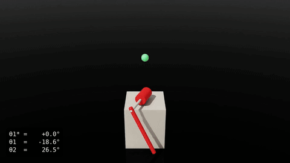
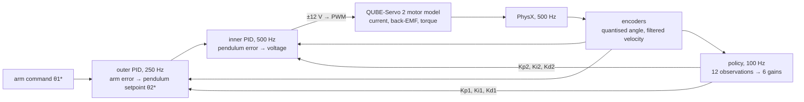
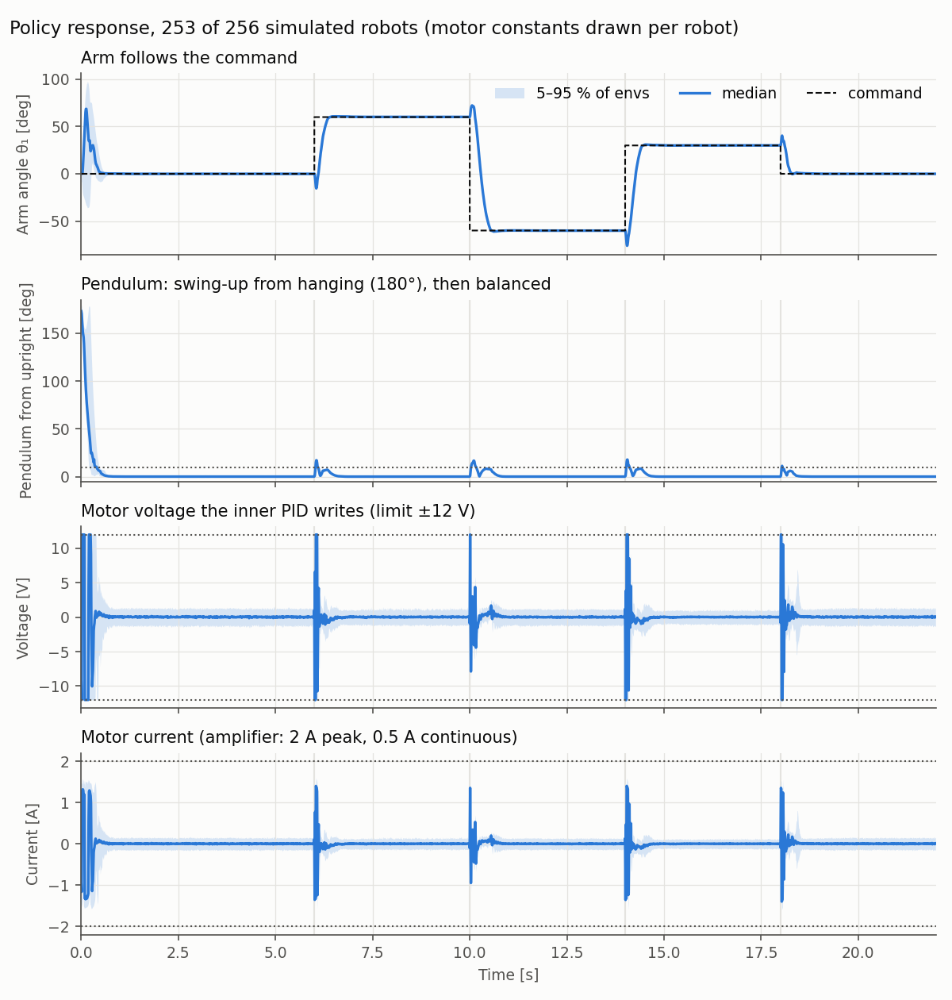
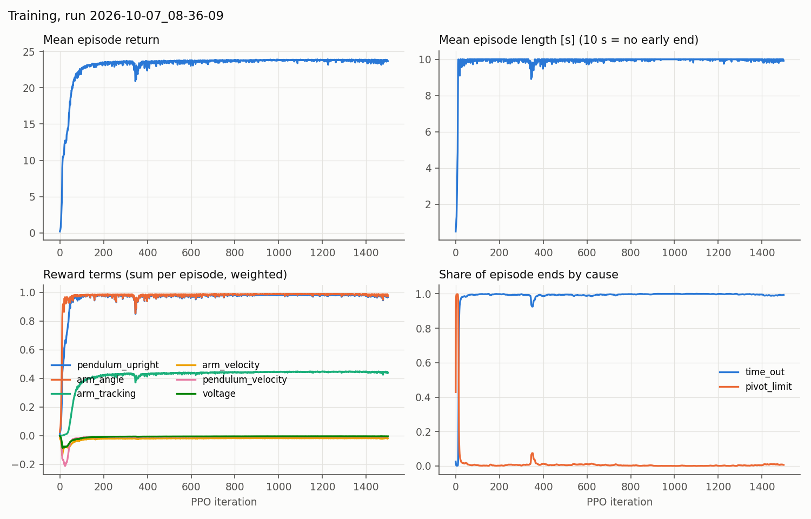

# Rotary Pendulum RL

**Reinforcement learning for a rotary pendulum with the Quanser QUBE-Servo 2 motor, in Isaac Lab 3.0.**

<p align="center">
  
</p>

## Control diagram



Task `Isaac-Rotary-Pendulum-PID`:

- **Action (6):** the gains Kp, Ki, Kd of both loops, in [−1, 1], scaled to their ranges.
- **Observation (12):** arm error to the command, the command, sin/cos θ2, both velocities (from the encoders), the last 6
  gains.
- **Goals:** pendulum upright; arm on the command, with one wide term and one narrow term that only pays while the
  pendulum is up.
- **Penalties:** arm velocity, pendulum velocity and voltage, each squared.
- **Episode end:** after 10 s, or if the arm turns more than half a turn.

## Results (simulation)

Trained with PPO (rsl_rl): 4096 robots in parallel, 1500 iterations, 64 minutes on one RTX 3060. The final policy then ran
one fixed scenario on 256 simulated robots, each with its own motor constants: start hanging, then arm steps to +60, −60,
+30 and 0° ([scripts/evaluate_policy.py](scripts/evaluate_policy.py)).

<p align="center"></p>

<details>
<summary>Training curves</summary>

<p align="center"></p>


</details>

## Requirements

- Ubuntu (x86_64), NVIDIA GPU with a recent driver (developed on an RTX 3060, 12 GB)
- [conda](https://docs.conda.io/projects/conda/en/latest/user-guide/install/index.html), Python 3.12
- Isaac Lab 3.0 next to this repo (`../IsaacLab`), installed in a conda environment `env_isaaclab`:

```bash
# run from the folder that holds this repo, so Isaac Lab ends up next to it
git clone https://github.com/isaac-sim/IsaacLab.git
cd IsaacLab
conda create -n env_isaaclab python=3.12 -y
conda activate env_isaaclab
python -m pip install --upgrade pip
./isaaclab.sh -i 'isaacsim,rl[rsl-rl]'      # Isaac Sim 6.1 + Isaac Lab + rsl_rl
which isaaclab && isaaclab --help           # the isaaclab command exists only after this step
```

The first Isaac Sim launch asks you to accept the NVIDIA EULA and downloads extensions, which can take a few minutes.
This project was not developed with the `uv` setup declared in `pyproject.toml`.

## Install

```bash
git clone <this repo>
conda activate env_isaaclab
cd Rotary_Pendulum_RL
pip install -e . --no-deps
pip install pytest
python -m pytest tests -q            # motor, encoders, URDF, task registration; no simulator window
```

## Usage

Trained weights ship in [pretrained/](pretrained/readme.md), so a fresh clone plays right away:

```bash
isaaclab play --rl_library rsl_rl --task Isaac-Rotary-Pendulum-PID --num_envs 4 --viz kit \
    --checkpoint pretrained/rotary_pendulum_pid/model_1499.pt
```

Everything else:

```bash
# train (logs in logs/rsl_rl/rotary_pendulum_pid/<date>/; --checkpoint <model_N.pt> resumes a run)
isaaclab train --rl_library rsl_rl --task Isaac-Rotary-Pendulum-PID --num_envs 4096

# watch your own run (without --checkpoint, play takes the latest run in logs/)
isaaclab play --rl_library rsl_rl --task Isaac-Rotary-Pendulum-PID --num_envs 4 --viz kit

# response chart and metrics on 256 robots -> docs/media/response_pid.png, response_pid_metrics.json
python scripts/evaluate_policy.py --checkpoint pretrained/rotary_pendulum_pid/model_1499.pt

# demo video (1080p, path traced) -> docs/media/demo_pid.mp4, .gif
python scripts/record_demo.py --checkpoint pretrained/rotary_pendulum_pid/model_1499.pt --gif

# training curves -> docs/media/training_pid.png
python scripts/plot_training.py logs/rsl_rl/rotary_pendulum_pid/<run> --out docs/media/training_pid.png
```

To check that the env builds in about a minute, add `--num_envs 64 --max_iterations 2` to the train command.

## Project layout

```text
src/Rotary_Pendulum_RL/
├── assets/data/qube_servo2/    qube_servo2.urdf, built from the CAD by scripts/build_qube_urdf.py
└── rotary/
    ├── rotary_cfg.py           robot, motor constants with sources, loop rates
    ├── mdp/
    │   ├── motor.py            PWM -> voltage -> current (back-EMF) -> torque
    │   ├── sensors.py          encoders: quantised angle, filtered velocity
    │   ├── actions.py          CascadePidAction: the two PID loops (the hook into Isaac Lab)
    │   ├── commands.py         arm angle command
    │   └── observations.py, rewards.py, terminations.py
    └── rl_control/
        ├── pid_env_cfg.py      Isaac-Rotary-Pendulum-PID
        └── agents/             PPO settings
scripts/                        evaluate_policy.py, record_demo.py, plot_training.py, build_qube_urdf.py
tests/                          motor, encoders, URDF, registration
pretrained/                     trained weights (checkpoint, ONNX / TorchScript export, run settings)
docs/media/                     video, GIF and charts of the README
guide/                          documentation
```


## License

[BSD-3-Clause](LICENSE), the license of Isaac Lab.
